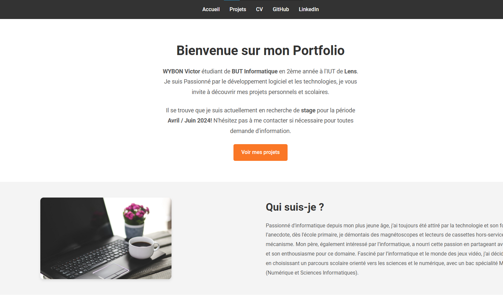
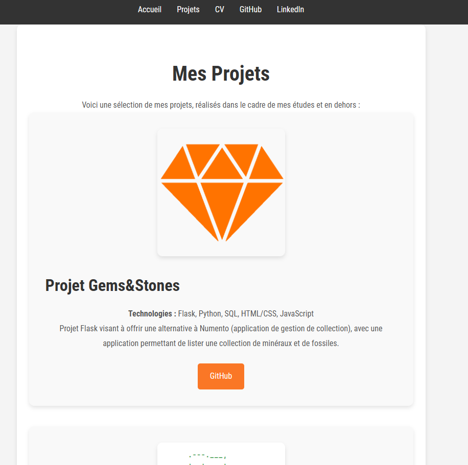
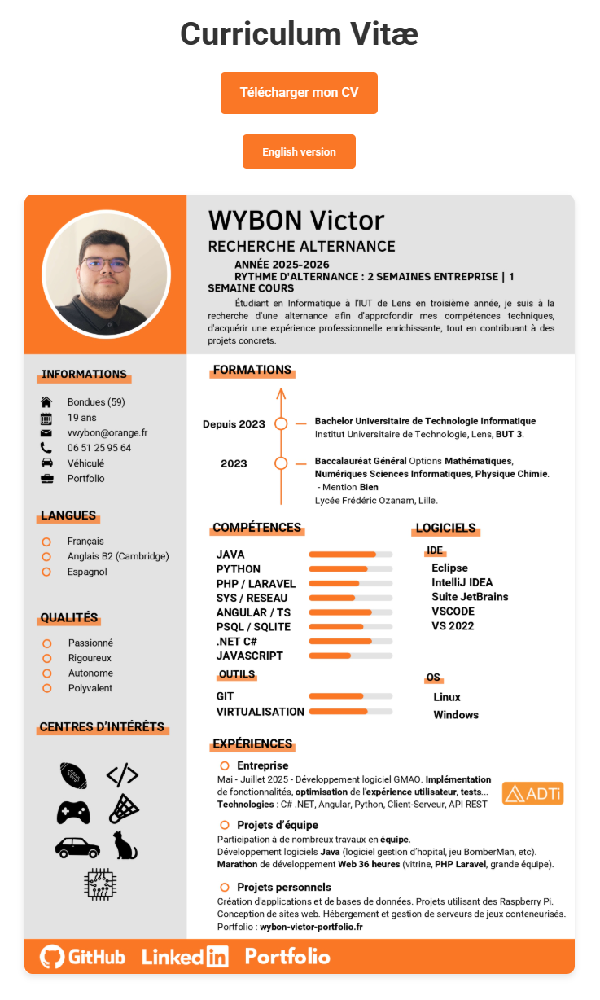

# 💼 Mon Portfolio

## 🚀 À propos du Portfolio

Ce portfolio est conçu pour offrir une vue d'ensemble de mes compétences techniques et de mes expériences.
L'objectif est de présenter mes travaux de manière claire et visuellement attrayante tout en assurant une navigation fluide pour les utilisateurs.

### Contenu

- **Page d'accueil** : Introduction, aperçu de mon parcours, compétences, et projets.
- **Projets** : Liste de mes projets avec des descriptions, une image, et des liens vers les dépôts GitHub.
- **CV** : Section dédiée à mon cv.

## 🛠️ Technologies Utilisées

- **HTML5** & **CSS3** : Pour la structure et le style de chaque page.
- **GitHub Pages** : Hébergement du site sur OVH.

## 📸 Captures d'écran

### Page d'accueil

### Section Projets

### Section CV

